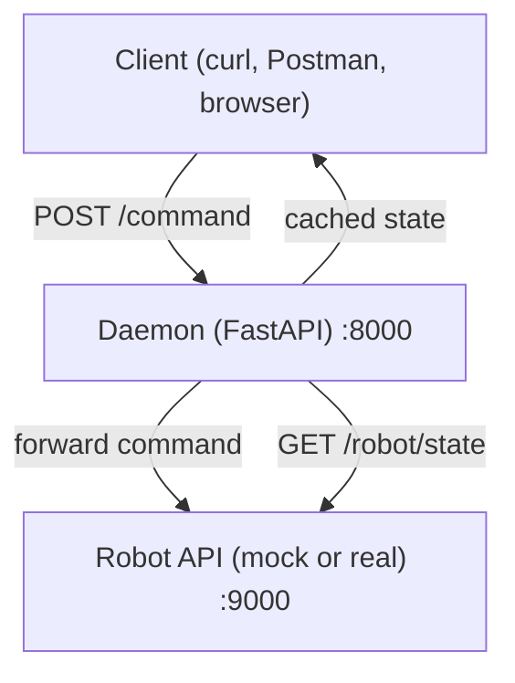

# Robot-Daemon 

This is a simple Python daemon built as part of the programming task. It’s designed to forward commands from HTTP to a local robot and periodically check the robot’s status. It’s straightforward and self-contained.

## 1. How to Run

The daemon is compiled using `pyinstaller`

To get started:

```bash
chmod +x install.sh
./install.sh  # this creates a Python venv and installs everything needed. It also makes the binary at dist/robotd
```

If you want to run it directly:
```bash
# Run the daemon
env/bin/python -m robot_daemon
```

Or for a non-technical person, just give them the binary in `dist/robotd`.

The daemon will start running on `http://0.0.0.0:8000`.


## 2. Quick Test 

For testing purposes, a fake robot (`mock_robot.py`) is provided. It listens locally and responds by echoing commands.

Start the mock robot first:

```bash
source env/bin/activate
python mock_robot.py
```

Then start the daemon in a second terminal:

```bash
env/bin/python -m robot_daemon
```

To test that everything is working, run these commands in another terminal:

```bash
curl -X POST http://127.0.0.1:8000/command \
     -H 'Content-Type: application/json' \
     -d '{"command":"PING"}'

curl http://127.0.0.1:8000/status
```

Expected output (approx.):

```json
{"result":{"echo":{"command":"PING","args":null}}}
{"state":{"status":"received PING"}}
```

This proves commands flow from your client → daemon → robot (mock), and status updates are correctly cached.


## 3. What's Going On 



## 4. Solution 

The entire forwarding path is only a few lines. In `robot_daemon/server.py` you’ll find

```python
@app.post("/command")
async def command(cmd: Command):
    return {"result": robot.send_command(cmd.dict())}
```

so an HTTP POST you send at `/command` is parsed and type‑checked by FastAPI/Pydantic, then passed straight through to `RobotAPI`. `RobotAPI` itself decides whether to talk REST or plain‑socket telnet based on the `mode` field in `config.yaml`:

```python
if mode == "rest":
    return requests.post(self.cfg["rest"]["url"], json=cmd, timeout=5).json()
with socket.create_connection((self.cfg["telnet"]["host"], self.cfg["telnet"]["port"]), timeout=5) as s:
    s.sendall((cmd["command"] + "\n").encode())
    return s.recv(4096).decode()
```

That single `if` keeps the code surface tiny; adding a third protocol later would mean dropping another branch into the same function or swapping in a small strategy object.

A background `Heartbeat` thread is launched from `main.py` the moment the daemon boots. 

```python
while not self._stop.is_set():
    try:
        self.robot.get_state()
    except Exception:
        pass
    time.sleep(self.interval)
```

Every thirty seconds (default) it asks the robot for `/state`, stashes the response under a thread‑safe lock, and ignores any network hiccups so the daemon never dies just because the robot was unplugged. The cached value is exposed to clients through `/status`:

```python
@app.get("/status")
async def status():
    return {"state": robot.last_state()}
```

The configuration is in `config.yaml`, parsed by a five‑line helper that simply wraps `yaml.safe_load`. The operators edit two URLs (command and state) or flip `mode: telnet`, restart the process, and the daemon now speaks to a different robot without touching code.

It's basically just one tiny HTTP layer, one thread for polling, one module that abstracts “how to talk to a robot,” and a YAML file gluing it all together. 

## Security Comments

In a production setting the daemon would no longer be a single process on a single host but part of a broader service mesh, and its security posture must evolve accordingly. First, all traffic should be encrypted in transit: the daemon must listen on HTTPS with a certificate issued by the organisation’s CA, and outbound calls to the robot (or to an edge‑side proxy that fronts the robot network) should use TLS or be encapsulated in an mTLS tunnel. Authentication and authorisation must move beyond implicit localhost trust; FastAPI’s dependency system makes it trivial to enforce JWT‑ or OAuth2‑based bearer tokens on every request, and the robot URLs themselves should be reachable only through a mutually‑authenticated side‑car proxy, so that compromised daemon instances cannot address arbitrary machines.

Secrets management must be delegated to a central store such as HashiCorp Vault, AWS Secrets Manager, or Kubernetes secrets; the YAML loader can be replaced with a thin wrapper that fetches credentials at start‑up and injects them into the same in‑memory structure, keeping rotation automatic and audit‑able.
